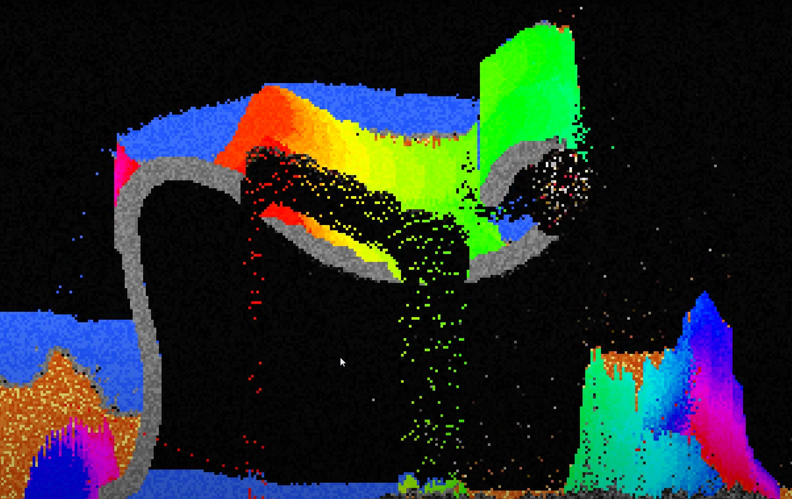
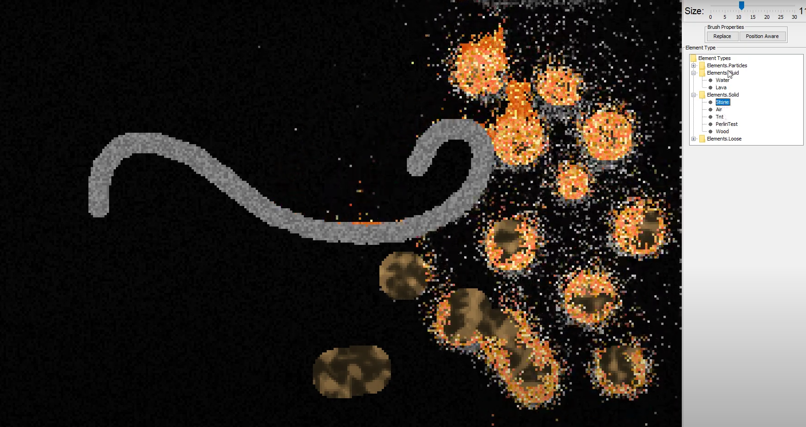

# 🧪 Sandbox Simulation

A multithreaded, interactive sandbox simulation inspired by falling-sand physics. This project simulates the behaviors and interactions between different element types—such as solids, fluids, and gases—within a dynamic, pixel-art-style environment.

## 🎮 Features

- **Element Interaction**: Simulates diverse behaviors of particles (e.g., sand, water, gas) and their interactions in a tile-based world.
- **Multithreading**: Efficient simulation using thread-safe data structures and synchronized locks for consistent parallel updates.
- **Modular Design**: Clean separation of logic via OOP and functional programming patterns.
- **Swing GUI**: Built-in graphical interface that allows real-time visualization and user interaction.
- **Perlin Noise Integration**: Procedural generation tools used to simulate realistic terrain and effects.

## 🧱 Project Structure

```
java/
├── Elements/       # Particle types and behavior logic (solid, fluid, loose, etc.)
├── GUI/            # Swing-based GUI components
├── Map/            # Grid management, chunk loading, and spatial utilities
├── Noice/          # Perlin noise utilities for procedural generation
└── Main.java       # Entry point
```

## 🔧 Technologies Used

- **Java** (Core, Concurrency)
- **Swing** for GUI
- **OOP + Functional Programming**
- **Custom Perlin Noise Library**

## 🖼️ Screenshots





## 🎥 Demo

Watch it in action on YouTube:  
[https://www.youtube.com/watch?v=vy_FdrJhSjk](https://www.youtube.com/watch?v=vy_FdrJhSjk)

## 🚀 Getting Started

### Requirements
- Java 17+
- IDE (e.g., IntelliJ, Eclipse) or CLI setup

### Run Instructions
1. Clone the repository:
   ```bash
   git clone https://github.com/SobiechQ/Simulation.git
   ```
2. Open the project in your preferred IDE.
3. Run `Main.java`.

## 📜 License

MIT License — feel free to fork, use, or adapt with attribution.
